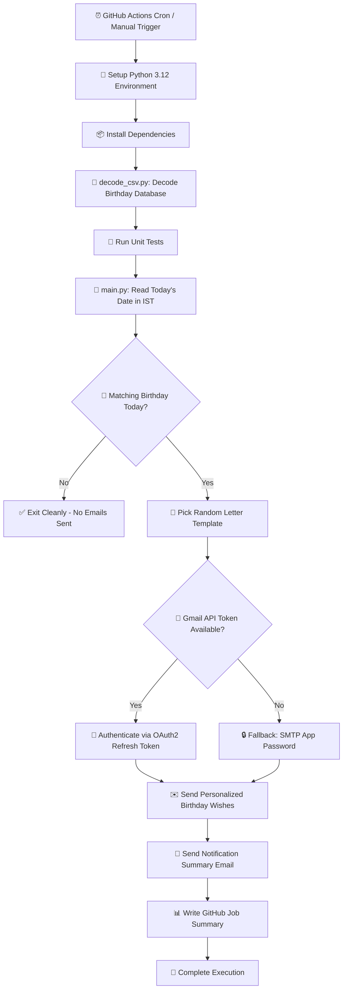
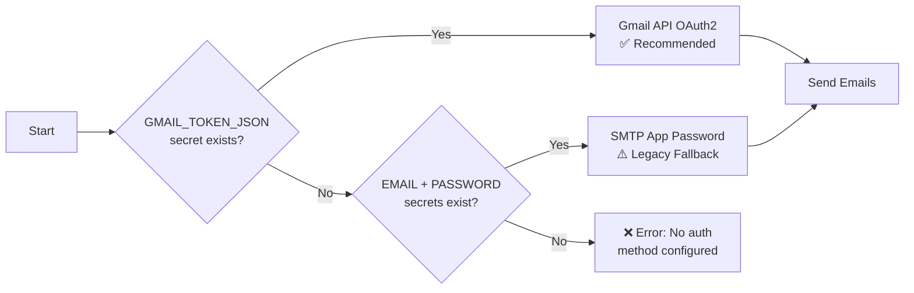

<div align="center">

  

  <br/><br/>

  <h1>🎉 Automated Birthday Wisher 🎂</h1>

  <p>
    <a href="https://readme-typing-svg.demolab.com">
      
    </a>
  </p>

  <p>
    
    
    
    
    
    
  </p>

  <p><b>Never miss a birthday again!</b> An intelligent, zero-maintenance cloud automation bot that scans your birthday database daily and sends personalized, randomly-templated birthday greetings via Gmail — powered entirely by GitHub Actions.</p>

</div>

---

## 📑 Table of Contents

- [✨ Features](#-features)
- [🏗️ System Architecture](#️-system-architecture)
- [📂 Directory Structure](#-directory-structure)
- [⚡ Quick Start & Setup Guide](#-quick-start--setup-guide)
  - [Step 1: Set Up Email Authentication](#step-1-set-up-email-authentication-gmail-api--oauth2)
  - [Step 2: Prepare Birthday Database](#step-2-prepare-birthday-database)
  - [Step 3: Configure GitHub Repository Secrets](#step-3-configure-github-repository-secrets)
  - [Step 4: Enable & Test the Workflow](#step-4-enable--test-the-workflow)
- [🔐 Security & Privacy](#-security--privacy)
- [📧 How Email Authentication Works](#-how-email-authentication-works)
- [💌 Customizing Email Templates](#-customizing-email-templates)
- [📢 Notification Summary Emails](#-notification-summary-emails)
- [💻 Local Setup & Development](#-local-setup--development)
- [🧪 Testing](#-testing)
- [🛠️ Troubleshooting & FAQ](#️-troubleshooting--faq)
- [📜 License](#-license)

---

## ✨ Features

| Feature | Description |
|---------|-------------|
| ⏰ **Automated Daily Trigger** | Runs every morning at ~**6:00 AM IST** via GitHub Actions cron schedule. |
| 🔑 **Gmail API OAuth2** | Uses long-lived OAuth2 refresh tokens that **never expire** — permanently eliminates 535 authentication errors. |
| 🔄 **SMTP Fallback** | Automatically falls back to SMTP App Password if Gmail API credentials are not configured. |
| 🔐 **Encrypted Database** | Birthday data is stored as a Base64-encoded secret — personal emails and dates are **never** exposed in the repository. |
| 🎨 **Randomized Templates** | Picks from multiple letter templates to keep birthday greetings fresh and unique for each person. |
| 🌐 **Timezone-Aware** | Uses **Asia/Kolkata (IST)** timezone evaluation so birthdays are never missed due to UTC shifts. |
| 📢 **Notification Alerts** | Sends a summary email to a configurable notification address whenever birthdays are detected and wishes are sent. |
| 🧪 **10 Unit Tests** | Comprehensive test suite covering both Gmail API and SMTP paths, sanitization, retries, and edge cases. |
| 📊 **GitHub Job Summary** | Writes success/failure reports to the GitHub Actions Job Summary for easy monitoring. |
| 🔁 **SMTP Retry Logic** | Automatically retries up to 3 times on transient network failures with exponential backoff. |
| 🧹 **Input Sanitization** | Strips invisible Unicode characters, zero-width spaces, and quotes from credentials to prevent auth issues. |
| 🧪 **Manual Dispatch** | Can be triggered on-demand from the GitHub Actions UI via `workflow_dispatch`. |

---

## 🏗️ System Architecture



### Workflow Steps Explained

1. **Environment Setup** — GitHub Actions provisions an Ubuntu runner with Python 3.12 and installs dependencies from `requirements.txt`.
2. **Database Decoding** — `decode_csv.py` reads the encrypted `BIRTHDAYS_CSV_DATA` secret, decodes it (Base64 or plain text), and writes `birthdays.csv`.
3. **Unit Tests** — All 10 test cases run to verify code integrity before sending any emails.
4. **Birthday Matching** — `main.py` reads today's date in IST and filters `birthdays.csv` for matching month + day entries.
5. **Authentication** — If `GMAIL_TOKEN_JSON` is available, authenticates via Gmail API OAuth2. Otherwise, falls back to SMTP with App Password.
6. **Email Dispatch** — For each birthday person, a random letter template is selected, personalized with the recipient's name, and sent.
7. **Notification** — A summary email is sent to the configured notification address listing all birthdays and send results.
8. **Reporting** — Success/failure details are written to the GitHub Actions Job Summary for easy monitoring.

---

## 📂 Directory Structure

```text
Automatic_Birthday_Wisher/
├── .github/
│   └── workflows/
│       └── birthday.yml          # GitHub Actions workflow (cron + manual dispatch)
├── assets/
│   └── banner.png                # Repository banner image
├── letter_templates/             # Customizable birthday message templates
│   ├── letter_1.txt
│   ├── letter_2.txt
│   └── letter_3.txt
├── birthdays.csv                 # Birthday database (decoded at runtime, NOT committed)
├── decode_csv.py                 # Decodes Base64/plain CSV from secrets into birthdays.csv
├── gmail_auth.py                 # Gmail API OAuth2 authentication helper module
├── setup_gmail_token.py          # One-time local script to generate OAuth2 refresh token
├── main.py                       # Core engine: date matching, email dispatch, notifications
├── test_main.py                  # Unit test suite (10 test cases)
├── requirements.txt              # Python dependencies
├── SETUP_GMAIL_API.md            # Detailed Gmail API setup instructions
├── .gitignore                    # Excludes credentials, tokens, and cache files
└── README.md                     # This file
```

> [!CAUTION]
> **Never commit** `credentials.json`, `token.json`, or `secret.txt` to the repository. These files contain sensitive OAuth tokens and are excluded via `.gitignore`.

---

## ⚡ Quick Start & Setup Guide

### Step 1: Set Up Email Authentication (Gmail API + OAuth2)

> [!TIP]
> **Gmail API with OAuth2** is the recommended method. It uses permanent refresh tokens that auto-renew — you'll **never** see 535 authentication errors again.

Follow the step-by-step guide in **[📖 SETUP_GMAIL_API.md](SETUP_GMAIL_API.md)** to:

1. Create a Google Cloud project
2. Enable the Gmail API
3. Create OAuth2 credentials (Desktop app)
4. Run `setup_gmail_token.py` locally to generate your refresh token
5. Save the token and credentials as GitHub repository secrets

**Estimated time:** ~10 minutes (one-time setup).

<details>
<summary><b>📌 Alternative: Google App Password (Legacy — not recommended)</b></summary>

<br/>

> [!WARNING]
> App Passwords expire when you change your Google password, disable 2FA, or when Google revokes them. This method will cause recurring **535 Bad Credentials** errors. Use Gmail API OAuth2 instead.

1. Log in to your Google Account at **[myaccount.google.com](https://myaccount.google.com/)**.
2. Go to **Security** → ensure **2-Step Verification** is **ON**.
3. Search for **App passwords** (or visit **[myaccount.google.com/apppasswords](https://myaccount.google.com/apppasswords)**).
4. Create an app password for `Mail` and copy the 16-character passcode.
5. Store it as the `PASSWORD` secret in your GitHub repository (see Step 3).
</details>

---

### Step 2: Prepare Birthday Database

Create a CSV file with the following format:

```csv
name,email,year,month,day
Alice,alice@example.com,1995,7,26
Bob,bob@example.com,1998,12,15
Charlie,charlie@example.com,2001,5,3
```

| Column | Type | Description |
|--------|------|-------------|
| `name` | String | Person's name (used in the `[NAME]` template placeholder) |
| `email` | String | Recipient's email address |
| `year` | Integer | Birth year |
| `month` | Integer | Birth month (1–12) |
| `day` | Integer | Birth day (1–31) |

#### Encrypt to Base64 (Recommended)

To keep contact details **private**, encode your CSV to Base64 before storing as a GitHub secret:

**Linux / macOS:**
```bash
base64 -w 0 birthdays.csv
```

**Windows (PowerShell):**
```powershell
[Convert]::ToBase64String([IO.File]::ReadAllBytes("birthdays.csv"))
```

Copy the output string — this becomes your `BIRTHDAYS_CSV_DATA` secret.

---

### Step 3: Configure GitHub Repository Secrets

Navigate to your repository: **Settings** → **Secrets and variables** → **Actions** → **New repository secret**.

#### Required Secrets (Gmail API — Recommended)

| Secret Name | Description | How to Get It |
|:---|:---|:---|
| `GMAIL_TOKEN_JSON` | OAuth2 token with refresh token | Generated by `setup_gmail_token.py` ([guide](SETUP_GMAIL_API.md)) |
| `GMAIL_CREDENTIALS_JSON` | OAuth2 client credentials | Downloaded from Google Cloud Console ([guide](SETUP_GMAIL_API.md)) |
| `BIRTHDAYS_CSV_DATA` | Base64-encoded birthday database | Encoded from your `birthdays.csv` (see Step 2) |

#### Optional Secrets

| Secret Name | Description | Default |
|:---|:---|:---|
| `NOTIFY_EMAIL` | Email address to receive daily birthday summary notifications | *(must be set — no default is used if not provided)* |

#### Legacy Secrets (App Password — only if not using Gmail API)

| Secret Name | Description |
|:---|:---|
| `EMAIL` | Your sender Gmail address |
| `PASSWORD` | 16-character Google App Password |

> [!IMPORTANT]
> **Never** paste actual passwords, tokens, or email addresses in your code or README. All sensitive values belong in **GitHub Repository Secrets** which are encrypted and hidden from logs.

---

### Step 4: Enable & Test the Workflow

1. Go to the **Actions** tab in your GitHub repository.
2. Select the **Birthday Wisher** workflow from the sidebar.
3. Click **Run workflow** → **Run workflow** to trigger a manual test run.
4. Check the workflow logs — you should see:
   ```
   Gmail API credentials detected. Using OAuth2 authentication...
   Gmail API: Access token refreshed successfully.
   Gmail API: Service authenticated successfully!
   Authentication method: Gmail API (OAuth2)
   ```
5. Once verified, the workflow will **automatically run daily** at ~6:00 AM IST.

---

## 🔐 Security & Privacy

This project is designed with security in mind. Here's how sensitive data is handled:

| Data | Protection Method |
|------|-------------------|
| **Gmail OAuth2 Tokens** | Stored as encrypted GitHub Secrets (`GMAIL_TOKEN_JSON`). Never committed to the repo. Listed in `.gitignore`. |
| **Gmail Client Credentials** | Stored as encrypted GitHub Secrets (`GMAIL_CREDENTIALS_JSON`). Never committed to the repo. Listed in `.gitignore`. |
| **Birthday Database** | Stored as a Base64-encoded GitHub Secret (`BIRTHDAYS_CSV_DATA`). Decoded only at runtime inside the GitHub Actions runner. |
| **App Password (Legacy)** | Stored as encrypted GitHub Secret (`PASSWORD`). Masked in workflow logs by GitHub. |
| **Email Addresses** | No personal email addresses are hardcoded in the source code. All are loaded from secrets or the encrypted CSV. |

### Files Excluded from Git (`.gitignore`)

```
credentials.json      # Google OAuth2 client credentials
token.json            # OAuth2 access + refresh token
secret.txt            # Local CSV fallback file
.env                  # Environment variable files
```

> [!CAUTION]
> If you fork this repository, **do not** commit your `credentials.json`, `token.json`, `birthdays.csv`, or any file containing personal data. Always use GitHub Secrets for sensitive information.

---

## 📧 How Email Authentication Works

The system supports two authentication methods, with automatic fallback:



### Gmail API OAuth2 (Recommended)

- **How it works**: Uses a long-lived **refresh token** stored in `GMAIL_TOKEN_JSON` to obtain short-lived access tokens automatically.
- **Token lifecycle**: Refresh tokens are permanent — they only expire if you revoke them manually or your Google Cloud project is deleted.
- **Scope**: Only requests `gmail.send` permission — the minimum required to send emails.
- **Module**: `gmail_auth.py` handles all OAuth2 logic including token refresh.

### SMTP App Password (Legacy Fallback)

- **How it works**: Connects to `smtp.gmail.com:587` using TLS and authenticates with your Gmail address + 16-character App Password.
- **Known issue**: App Passwords expire when you change your Google password, toggle 2-Step Verification, or when Google revokes them — causing recurring **535 Bad Credentials** errors.
- **Retry logic**: Automatically retries up to 3 times with 2-second delays for transient network failures.

---

## 💌 Customizing Email Templates

Templates are stored in the `letter_templates/` directory. The script randomly selects one template for each birthday person.

### Template Placeholder

Use `[NAME]` in your template — it will be replaced with the birthday person's name from the CSV.

### Example Template

```text
Dear [NAME],

Happy birthday! 🎉

May your year ahead be filled with happiness, health, and success!

Best wishes,
Automated Birthday Wisher
```

### Adding More Templates

1. Create a new file: `letter_templates/letter_4.txt`
2. Update the random range in `main.py` line:
   ```python
   file_path = f"letter_templates/letter_{random.randint(1, 4)}.txt"
   ```
3. Commit and push your changes.

---

## 📢 Notification Summary Emails

After sending birthday wishes, the bot sends a **summary notification email** to the address configured in the `NOTIFY_EMAIL` secret. This email includes:

- 📋 List of today's birthday celebrants (name + email)
- ✅ Number of wishes sent successfully
- ❌ Number of failed sends (with error details)
- 📊 Total birthdays found for the day

To configure, set the `NOTIFY_EMAIL` secret in your GitHub repository settings.

---

## 💻 Local Setup & Development

### Prerequisites

- Python 3.12+
- pip package manager
- A Gmail account with Gmail API OAuth2 configured (see [SETUP_GMAIL_API.md](SETUP_GMAIL_API.md))

### Setup

```bash
# 1. Clone the repository
git clone https://github.com/ragul-r-v/birthday-wisher.git
cd birthday-wisher

# 2. Install dependencies
pip install -r requirements.txt

# 3. Place your birthdays.csv in the project root
# (See Step 2 in Quick Start for the CSV format)

# 4. Set up Gmail API authentication (one-time)
python setup_gmail_token.py
# Follow the browser prompt to authorize

# 5. Run with Gmail API (recommended)
# Set the token as an environment variable:
# Windows (PowerShell):
$env:GMAIL_TOKEN_JSON = Get-Content token.json -Raw
python main.py

# Linux / macOS:
export GMAIL_TOKEN_JSON=$(cat token.json)
python main.py
```

<details>
<summary><b>Running with SMTP App Password (Legacy)</b></summary>

```bash
# Windows (PowerShell):
$env:EMAIL = "yourname@gmail.com"
$env:PASSWORD = "your16charapppassword"
python main.py

# Linux / macOS:
export EMAIL="yourname@gmail.com"
export PASSWORD="your16charapppassword"
python main.py
```

</details>

---

## 🧪 Testing

The project includes **10 comprehensive unit tests** covering all critical paths:

```bash
# Run all tests
python -m unittest test_main.py -v
```

| Test | Description |
|------|-------------|
| 1. Credential Sanitization | Verifies quotes, spaces, tabs, and zero-width Unicode chars are stripped from credentials |
| 2. Successful SMTP Wishes | Verifies email sending via SMTP when credentials are valid |
| 3. SMTP Auth Failure | Verifies proper handling of 535 Bad Credentials error |
| 4. Missing Environment Vars | Verifies error handling when no auth method is available |
| 5. SMTP Transient Retry | Verifies retry logic recovers from transient network drops |
| 6. Empty Birthday List | Verifies clean exit (code 0) when no birthdays match today |
| 7. Partial Send Failure | Verifies system handles individual send failures without crashing |
| 8. CSV Decode | Verifies Base64 encoding/decoding of birthday CSV data |
| 9. Gmail API Send | Verifies email sending via Gmail API OAuth2 path (mocked) |
| 10. Gmail API Fallback | Verifies automatic fallback to SMTP when Gmail API is not configured |

---

## 🛠️ Troubleshooting & FAQ

<details>
<summary><b>❌ Error: (535, b'5.7.8 Username and Password not accepted')</b></summary>

<br/>

**Cause:** Your App Password has expired or is invalid. This is the most common issue with SMTP authentication.

**Permanent Fix (Recommended):**
Switch to **Gmail API with OAuth2** — follow [SETUP_GMAIL_API.md](SETUP_GMAIL_API.md). OAuth2 refresh tokens don't expire, permanently eliminating this error.

**Temporary Fix:**
1. Go to [myaccount.google.com/apppasswords](https://myaccount.google.com/apppasswords).
2. Generate a new App Password.
3. Update the `PASSWORD` secret in your GitHub repository.
</details>

<details>
<summary><b>❌ Error: BIRTHDAYS_CSV environment variable is empty</b></summary>

<br/>

**Cause:** The workflow can't find the birthday database secret.

**Fix:** Ensure you created `BIRTHDAYS_CSV_DATA` in **Settings > Secrets and variables > Actions** with either the Base64-encoded or raw CSV content.
</details>

<details>
<summary><b>❌ Error: GMAIL_TOKEN_JSON is missing required fields</b></summary>

<br/>

**Cause:** The token JSON is incomplete or corrupted.

**Fix:** Re-run `python setup_gmail_token.py` locally to generate a fresh token, then update the `GMAIL_TOKEN_JSON` secret.
</details>

<details>
<summary><b>❌ Error: Failed to refresh Gmail API access token</b></summary>

<br/>

**Cause:** The OAuth2 refresh token was revoked (e.g., you removed the app from your Google account permissions).

**Fix:**
1. Re-run `python setup_gmail_token.py` locally.
2. Complete the browser authorization.
3. Update the `GMAIL_TOKEN_JSON` secret with the new token.
</details>

<details>
<summary><b>❌ Access blocked: Birthday Wisher has not completed Google verification</b></summary>

<br/>

**Cause:** Your Gmail address is not listed as a test user in the Google Cloud OAuth consent screen.

**Fix:**
1. Go to [Google Cloud Console → OAuth consent screen](https://console.cloud.google.com/apis/credentials/consent).
2. Scroll to **Test users** → **Add users**.
3. Add your Gmail address and save.
</details>

<details>
<summary><b>⏰ Why did the workflow trigger at a slightly different time?</b></summary>

<br/>

GitHub Actions cron schedules run on shared runners and may be delayed by a few minutes during peak times. The script uses explicit **IST Timezone (`Asia/Kolkata`)** evaluation internally, so dates are always calculated accurately regardless of runner timing delays.
</details>

<details>
<summary><b>🔄 How do I switch from App Password to Gmail API?</b></summary>

<br/>

1. Follow the [SETUP_GMAIL_API.md](SETUP_GMAIL_API.md) guide to generate OAuth2 credentials.
2. Add `GMAIL_TOKEN_JSON` and `GMAIL_CREDENTIALS_JSON` secrets to your repository.
3. The workflow will **automatically** use Gmail API when these secrets are present.
4. You can optionally delete the old `EMAIL` and `PASSWORD` secrets once Gmail API is verified.
</details>

<details>
<summary><b>📧 How do I change the notification email address?</b></summary>

<br/>

Set the `NOTIFY_EMAIL` secret in your GitHub repository (**Settings → Secrets → Actions → New secret**) to any email address where you want to receive daily birthday summary notifications.
</details>

---

## 📜 License

Distributed under the **MIT License**. See `LICENSE` for more information.

<div align="center">
  <br/>
  <sub>Built with ❤️ & Python for effortless birthday celebrations.</sub>
  <br/><br/>
  <sub>⭐ Star this repo if you find it useful!</sub>
</div>
