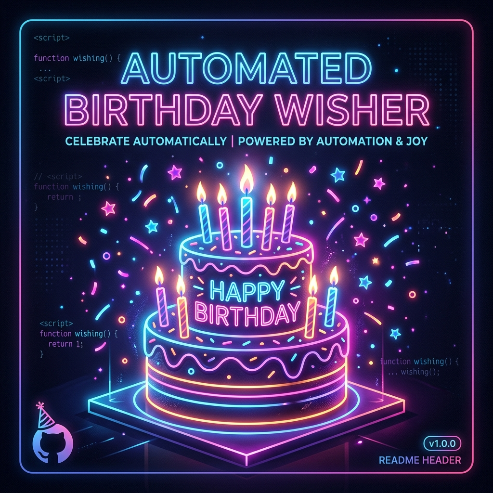
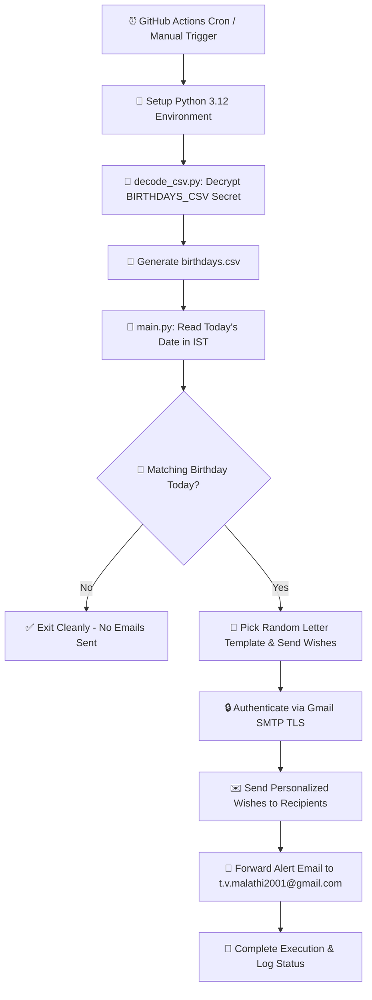

<div align="center">

  

  <br/><br/>

  <h1>🎉 Automated Birthday Wisher 🎂</h1>

  <p>
    <a href="https://readme-typing-svg.demolab.com">
      
    </a>
  </p>

  <p>
    
    
    
    
    
  </p>

  <p><b>Never miss a birthday again!</b> An intelligent, zero-maintenance cloud automation bot that scans your birthday database daily and sends personalized, randomly-templated birthday greetings automatically.</p>

</div>

---

## 📑 Table of Contents

- [✨ Features](#-features)
- [🏗️ System Architecture](#️-system-architecture)
- [📂 Directory Structure](#-directory-structure)
- [⚡ Quick Start & Setup Guide](#-quick-start--setup-guide)
  - [Step 1: Generate Google App Password](#step-1-generate-google-app-password)
  - [Step 2: Prepare Birthday Database](#step-2-prepare-birthday-database)
  - [Step 3: Configure GitHub Repository Secrets](#step-3-configure-github-repository-secrets)
  - [Step 4: Enable & Test GitHub Actions Workflow](#step-4-enable--test-github-actions-workflow)
- [💌 Customizing Email Templates](#-customizing-email-templates)
- [💻 Local Setup & Development](#-local-setup--development)
- [🛠️ Troubleshooting & FAQ](#️-troubleshooting--faq)
- [📜 License](#-license)

---

## ✨ Features

- ⏰ **Automated Daily Trigger**: Runs every morning at **7:00 AM IST** via GitHub Actions scheduled cron.
- 🔐 **Encrypted Database Support**: Decodes base64-encoded CSV datasets on the fly (`decode_csv.py`), protecting personal emails and dates from public exposure.
- 🎨 **Randomized Greeting Templates**: Picks from multiple pre-formatted letter templates to keep wishes fresh and unique.
- 🌐 **Timezone-Aware Execution**: Evaluates dates in **Asia/Kolkata (IST)** so birthdays are never missed or miscalculated due to UTC shifts.
- 📧 **Secure Gmail SMTP Integration**: Transmits encrypted TLS emails using modern Python `EmailMessage` standard.
- 📢 **Daily Birthday Alert Notification**: Automatically forwards a summary notification email to `t.v.malathi2001@gmail.com` whenever birthdays are detected today.
- 🧪 **Manual Dispatch Enabled**: Allows on-demand workflow triggering directly from GitHub UI.

---

## 🏗️ System Architecture



---

## 📂 Directory Structure

```text
Automatic_Birthday_Wisher/
├── .github/
│   └── workflows/
│       └── birthday.yml       # GitHub Actions Cron & Dispatch Workflow
├── assets/
│   └── banner.png             # Repository Banner Header Image
├── letter_templates/          # Customizable Birthday Message Templates
│   ├── letter_1.txt
│   ├── letter_2.txt
│   └── letter_3.txt
├── birthdays.csv              # Birthday Dataset (Decoded at runtime)
├── decode_csv.py              # Decodes Base64 CSV secret into birthdays.csv
├── main.py                    # Main Engine: Date checking & Email dispatcher
├── requirements.txt           # Dependencies (pandas)
└── README.md                  # Comprehensive Documentation
```

---

## ⚡ Quick Start & Setup Guide

### Step 1: Generate Google App Password

> [!IMPORTANT]
> Standard Gmail passwords **do not work** with SMTP due to Google security policies. You **must** generate a 16-character **App Password**.

1. Log in to your Google Account at **[myaccount.google.com](https://myaccount.google.com/)**.
2. Go to **Security** and ensure **2-Step Verification** is turned **ON**.
3. In the top search bar, search for **App passwords** (or visit **[myaccount.google.com/apppasswords](https://myaccount.google.com/apppasswords)**).
4. Enter an app name (e.g. `GitHub Birthday Wisher`) and click **Create**.
5. Copy the generated **16-character passcode** (e.g., `abcd efgh ijkl mnop`).

---

### Step 2: Prepare Birthday Database

Create a CSV dataset containing your contacts' birthdays. 

#### CSV Format (`birthdays.csv`):
```csv
name,email,year,month,day
Alice,alice@example.com,1995,7,26
Bob,bob@example.com,1998,12,15
Charlie,charlie@example.com,2001,5,3
```

#### Encrypt to Base64 (Optional but Recommended):
To keep contact details private on GitHub, convert your CSV file to a Base64 string:

- **Linux / macOS**:
  ```bash
  base64 -w 0 birthdays.csv
  ```
- **Windows (PowerShell)**:
  ```powershell
  [Convert]::ToBase64String([IO.File]::ReadAllBytes("birthdays.csv"))
  ```

---

### Step 3: Configure GitHub Repository Secrets

1. Open your repository on GitHub.
2. Navigate to **Settings** > **Secrets and variables** > **Actions**.
3. Add the following **Repository Secrets**:

| Secret Name | Value Description | Example |
| :--- | :--- | :--- |
| `EMAIL` | Your sender Gmail address | `yourname@gmail.com` |
| `PASSWORD` | 16-character Google App Password | `abcdefghijklmnop` |
| `BIRTHDAYS_CSV_DATA` | Base64-encoded string or raw content of `birthdays.csv` | `bmFtZSxlbWFpbC...` |

---

### Step 4: Enable & Test GitHub Actions Workflow

1. Go to the **Actions** tab in your repository.
2. Select **Birthday Wisher** workflow.
3. Click **Run workflow** > **Run workflow** to test execution manually.
4. The workflow will automatically run every day at **7:00 AM IST** (`27 0 * * *` UTC).

---

## 💌 Customizing Email Templates

Templates are stored in the `letter_templates/` directory. You can add or edit templates using the `[NAME]` placeholder:

#### Example `letter_1.txt`:
```text
Dear [NAME],

Happy birthday! 🎉

May your year ahead be filled with happiness, health, and success!

Best wishes,
Automated Birthday Wisher
```

The script automatically selects a random template (`letter_1.txt`, `letter_2.txt`, `letter_3.txt`) for each birthday person.

---

## 💻 Local Setup & Development

Want to test or run the script locally on your machine?

```bash
# 1. Clone the repository
git clone https://github.com/your-username/Automatic_Birthday_Wisher.git
cd Automatic_Birthday_Wisher

# 2. Install dependencies
pip install -r requirements.txt

# 3. Create your local birthdays.csv file
# Add your birthdays.csv directly in the project root

# 4. Set environment variables & run
# Windows (PowerShell):
$env:EMAIL="yourname@gmail.com"
$env:PASSWORD="your16charapppassword"
python main.py

# Linux / macOS:
export EMAIL="yourname@gmail.com"
export PASSWORD="your16charapppassword"
python main.py
```

---

## 🛠️ Troubleshooting & FAQ

<details>
<summary><b>❌ Error: (535, b'5.7.8 Username and Password not accepted')</b></summary>

<br/>

**Cause:** You are using your normal Gmail login password instead of a Google App Password, or 2FA is disabled.

**Fix:**
1. Enable 2-Step Verification on your Google Account.
2. Generate an **App Password** at [myaccount.google.com/apppasswords](https://myaccount.google.com/apppasswords).
3. Update your `PASSWORD` secret in GitHub Repository Secrets.
</details>

<details>
<summary><b>❌ Error: BIRTHDAYS_CSV environment variable is empty</b></summary>

<br/>

**Cause:** The workflow cannot find the `BIRTHDAYS_CSV_DATA` secret in GitHub.

**Fix:** Ensure you created `BIRTHDAYS_CSV_DATA` or `BIRTHDAYS_CSV` in **Settings > Secrets and variables > Actions**.
</details>

<details>
<summary><b>⏰ Why did the workflow trigger at a slightly different time?</b></summary>

<br/>

GitHub Actions cron schedules run on shared runners and may be delayed by a few minutes during peak times. The script uses explicit **IST Timezone (`Asia/Kolkata`)** evaluation to ensure dates are always accurate regardless of delays.
</details>

---

## 📜 License

Distributed under the **MIT License**. See `LICENSE` for more information.

<div align="center">
  <sub>Built with ❤️ & Python for effortless birthday celebrations.</sub>
</div>
